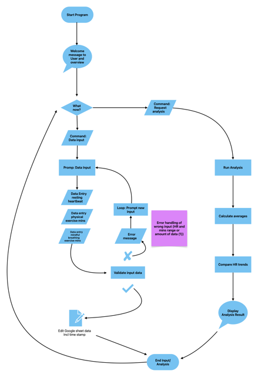
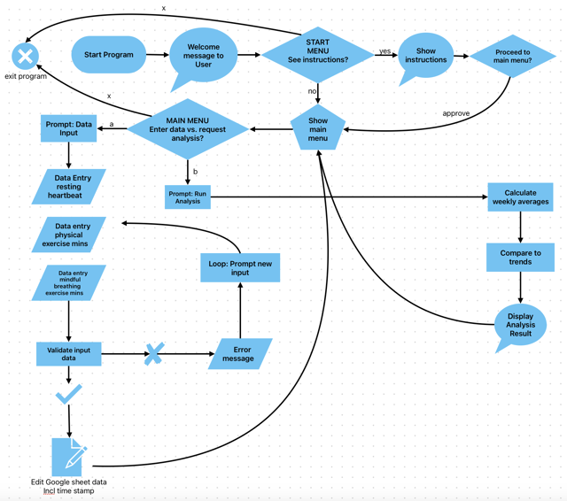

# Coolness tracker
An assistant for lowering your resting heartbeat and live a calmer life.

**Project Overview: Lower your resting heartbeat**  
This application helps users explore the relationship between cardiovascular exercise, mindful breathing, and resting heart rate. By tracking three key metrics (lowest resting heart rate during sleep, daily cardio minutes, and mindful breathwork minutes) users can gain insights into how their habits impact their overall well-being - because the lower the resting heartbeat, the more chill is life.

The data entered is stored anonymously, and the option for last week's analysis provides a clear summary of trends to encourage a healthier, more relaxed lifestyle.

**Key metrics** for this Python analysis are the user’s lowest heart rate during sleep, total minutes of cardiovascular exercise during the day, and total minutes of intentional breathing exercises during one day.

**Main Goal:** Analyze the relationship between heart rate, cardiovascular activity, and relaxation practices to understand their impact on resting heart rate and overall well-being.

## Workflow 
<details>
<summary>Process flowcharts</summary>

<details>
<summary>Flowchart.1</summary>



[Link to process flowchart 1 for higher resolution](https://drive.google.com/file/d/1WOr0uh1Km6rs3N1jSxBHXMMrOjg33fCc/view?usp=sharing)

</details>

<details>
<summary>Flowchart.2</summary>



[Link to process flowchart 2 for higher resolution](https://drive.google.com/file/d/1FIiiGRFyn7p4dhGeM7953NLfwcWvprex/view?usp=sharing)

</details>
</details>

## User stories 

<details>
<summary>**As a user …**</summary>

+ …I want a welcome message when I start the program that explains the purpose of the application and how it can benefit me.

+ …I want to easily understand how to input my data, so I can log my information without confusion or mistakes.

+ …I want clear, friendly prompts for each data entry, so I know exactly what is expected of me at each step.

+ …I want to be able to see a simple summary of my recent stats in one command, so I don’t have to look at long reports if I don’t want to.

+ …I want to be able to see if my resting heart rate is trending up or down.

+ …I want to understand how my cardio and relaxation practices impact my resting heart rate over time so that I keep up the healthy habits in order to lower it effectively.

+ …I want to log my daily lowest heart rate during sleep, total minutes of cardiovascular exercise, and total minutes of breathing exercises, so I can see the effect of my habits on my heart health over time.

+ …I want the program to notify me of the correct format and give me another chance to input valid data, if I input incorrect data (e.g., text instead of numbers etc.).

+ …I want the application to guide me back to the main input prompt after I make a mistake, so I can correct it easily without restarting.

+ …I want the analysis feedback to feel positive and helpful, highlighting any progress or improvements to keep me motivated.

+ …I want to receive a motivational message in the summary when I run an analysis, so I can feel encouraged to track my data daily and maintain consistentcy.

+ …I want a detailed view of correlations between my heart rate and my exercise and breathing practices to understand the effect of my health habits on the resting heartrate.

+ …I want to be able to exit the program smoothly and know that my data is saved, so I feel safe in using the application correctly and therefore trust the data analysis.

!!!
+ ...I want the application to allow me to skip logging on some days, without affecting my trend analysis, so I feel comfortable using it at my own pace.  

!!!

</details>

## Features
<details>
<summary>List of features</summary>
• Welcome message and start menu
• Data validation: Regular resting heart rate [Source](https://www.mayoclinic.org/healthy-lifestyle/fitness/expert-answers/heart-rate/faq-20057979#:~:text=Answer%20From%20Edward%20R.%20Laskowski,to%20100%20beats%20per%20minute.); Maximum cardio minutes [Source](https://odphp.health.gov/our-work/nutrition-physical-activity/physical-activity-guidelines/current-guidelines/top-10-things-know) - But I decided to go a maximum input of 24h = 1.440 min. as for the breathwork minutes
</details>

## Testing
<details>
<summary>Bugs</summary>

| **Bug Description** | **Screenshot** | **Fix** | 
|---------------------|----------------|---------|
| print statement too long |  | Divided print statement in several lines |
| Error when inputtin uppercase or spaces in start menu |  | add .strip() and .lower() methods to input field: ```instruction_choice = input("Do you need instructions? ").strip().lower()``` |
| Input upon main_menu redirects to start_menu instaed of displaying main_choice options |  | add return statement to main_menu function; remove start_menu loop; comment out validate to proceed to main_menu after instructions; remove main_menu call from elif "no" to jump instructions; |
| health data input validation error |  | put conversion ```int(heartrate_str)``` inside try/except code and wrap everything in a loop to give user a chance to put in right heartrate upon mistake |
</details>

## Credits 

<details>
<summary>Resources</summary>
- Code Institute's walkthrough project **Love Sandwiches** introduced me to most of the basic functions, module imports and methods.
- As an initial inspiration on how to get started on my project idea I used a [YouTube tutorial](https://www.youtube.com/watch?v=ZBx7oWCJ4aY) that introduced how to use while true loops to build menus.
- To learn about more python string methods, for the input and it's validation, the datetime module, list comprehensions, try/except, handling of tuples and more research about built-in functions I have mainly relied on the [W3Schools website](https://www.w3schools.com/python/), sometimes on [Stackoverflow](https://stackoverflow.com/).
</details>