# Coolness tracker


An assistant for lowering your resting heartbeat and live a calmer life.
[Click here to access live project terminal](https://coolness-tracker-7669906b729c.herokuapp.com/).

## Overview 

**Project Overview: Lower your resting heartbeat**  
This application helps users explore the relationship between cardiovascular exercise, mindful breathing, and resting heart rate. By tracking three key metrics (lowest resting heart rate during sleep, daily cardio minutes, and mindful breathwork minutes) users can gain insights into how their habits impact their overall well-being - because the lower the resting heartbeat, the more chill is life.

The data entered is stored anonymously, and the option for last week's analysis provides a clear summary of trends to encourage a healthier, more relaxed lifestyle.

**Key metrics** for this Python analysis are the user’s lowest heart rate during sleep, total minutes of cardiovascular exercise during the day, and total minutes of intentional breathing exercises during one day.

**Main Goal:** Analyze the relationship between heart rate, cardiovascular activity, and relaxation practices to understand their impact on resting heart rate and overall well-being.

## Workflow 
<details>
<summary>Process flowcharts</summary>

<details>
<summary>Flowchart.1</summary>

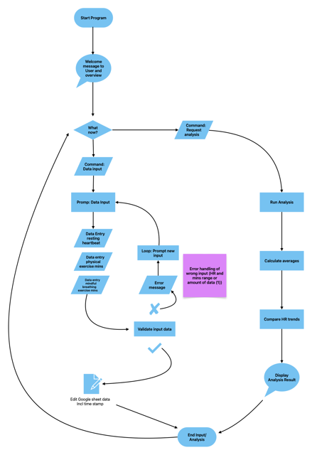

[Link to process flowchart 1 for higher resolution](https://drive.google.com/file/d/1WOr0uh1Km6rs3N1jSxBHXMMrOjg33fCc/view?usp=sharing)

</details>

<details>
<summary>Flowchart.2 (final version)</summary>


[Link to process flowchart 2 for higher resolution](https://drive.google.com/file/d/1FIiiGRFyn7p4dhGeM7953NLfwcWvprex/view?usp=sharing)

</details>
</details>

## User stories 

<details>
<summary>As a user …</summary>

+ …I want a welcome message when I start the program that explains the purpose of the application and how it can benefit me.

+ …I want to easily understand how to input my data, so I can log my information without confusion or mistakes.

+ …I want clear, friendly prompts for each data entry, so I know exactly what is expected of me at each step.

+ …I want to be able to see a simple summary of my recent stats in one command, so I don’t have to look at long reports if I don’t want to.

+ …I want to log my daily lowest heart rate during sleep, total minutes of cardiovascular exercise, and total minutes of breathing exercises, so I can see the effect of my habits on my heart health over time.

+ …I want the program to notify me of the correct format and give me another chance to input valid data, if I input incorrect data (e.g., text instead of numbers etc.).

+ …I want the application to guide me back to the main input prompt after I make a mistake, so I can correct it easily without restarting.

+ …I want the analysis feedback to feel positive and helpful to keep me motivated.

+ …I want to receive a motivational message in the summary when I run an analysis, so I can feel encouraged to track my data daily and maintain consistentcy.

+ …I want to be able to exit the program smoothly and know that my data is saved, so I feel safe in using the application correctly and therefore trust the data analysis.

+ ...I do NOT want to necessarily have to track my data daily. I want to be able to skip days without it affecting my weekly summary, so I feel comfortable using the program at my own pace. 

</details>

## Deployment

<details>
<summary>Open to view detailed deployment steps</summary>

Before deploying, ensure you've completed the following:
- Remove unnecessary imports used for testing that aren't needed in the final Heroku deployment.
- Add a line using `\n` after input statements for technical reasons.
- Update requirements.txt to include all dependencies using terminal command "pip3 freeze > requirements.txt"
- Sign up for a Heroku account and link it to GitHub.
- Add billing information to deploy and run apps on Heroku.

Deployment steps after setting up account on Heroku:
1. In the top-right corner of your Heroku Dashboard, click "New", then choose "Create new app" from the dropdown. (On first app deployment you'll see a button to select on the dashboard directly.)
2. Enter a unique name for your app, select the region you live in or that is closest to you (USA or EU), and click "Create App".
3. In your app’s Settings, select "Reveal Config Vars". Set "PORT" as the KEY and "8000" as the value, then click "Add".
4. Add another Config Var. Set "CREDS" as the KEY, copy the creds.json file in your workspace and paste it into the VALUE field, then click "Add".
5. Scroll down to the Buildpacks section and click "Add buildpack" to manage dependencies.
6. Ensure the buildpacks are in the correct order: Python first, followed by Node.js.
7. Navigate to the deploy section to choose deployment method.
8. Under "Deployment method", select "Github".
9. Confirm that you want to connect to Github. Sign in to Github via the pop-up window.
10. After confirming you can search for your Github repository name by typing in the name of your repository, click "Search", and finally, "Connect" to link up the Heroku app to your Github repository code.
11. Scroll down and navigate to "Deploy branch". Choose a branch to deploy. Optionally select "Enable Automatic Deploys".
12. After deployment is completed, you receive a message "Your app was successfully deployed." Select "View" to open your deployed link.
13. You will be automatically redirected to the running Mock Terminal.

See live Project Terminal here: https://coolness-tracker-7669906b729c.herokuapp.com/

See also [deployment documentation on Heroku's website](https://devcenter.heroku.com/articles/git). As well as [more information about cloning a Github repository](https://docs.github.com/en/repositories/creating-and-managing-repositories/cloning-a-repository).

</details>

## Features

### Existing Features

1. <u>Start of the program with a welcoming introductory message</u>

    

2. <u>Display of START MENU with input</u>

    

    The START MENU presents the user with two options:

    1. View the program's instructions.
    2. Skip this step and proceed directly to the MAIN MENU.

    Additionally, the option to exit the program is always available in the menus.

3. <u>Display of instruction of the program</u>

    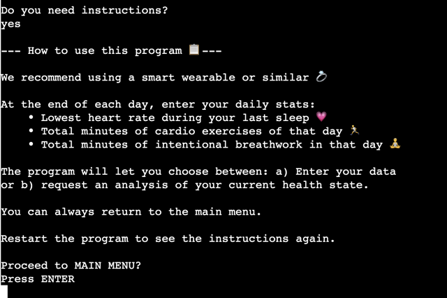

    The program prompts the user to type "yes" and press ENTER to view the instructions. Upon entering "yes," the instructions are displayed as shown above. To give users enough time to read the instructions, the program enforces manual input before proceeding to the MAIN MENU.

4. <u>Handling of Error Inputs during START MENU</u>

    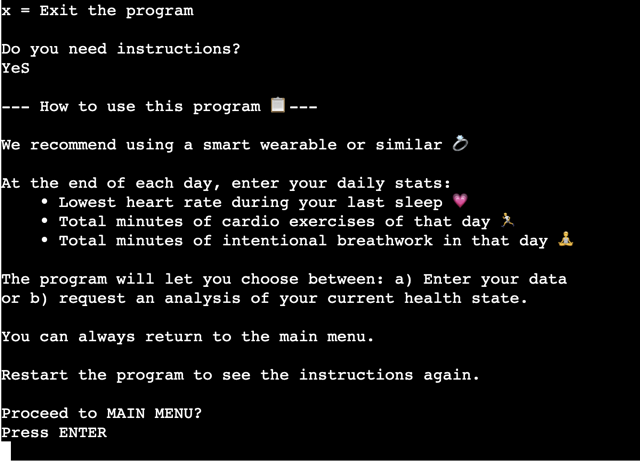

    The input field is designed to handle variations in capitalization and formatting of the required input "yes", using the `.lower()` method. By using the `strip()` method, extra whitespace is removed, allowing "yes" and "no" to be validated correctly, even if the input has leading or trailing spaces.

5. <u>Handling Random Input upon ENTER to proceed to MAIN MENU</u>

    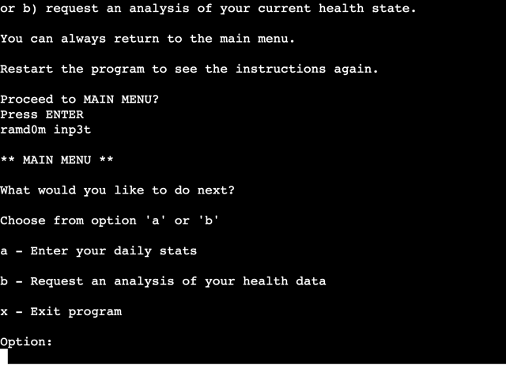

    The validation for proceeding to the MAIN MENU accepts any input, including an empty string. As long as the ENTER key is pressed, the program advances to the MAIN MENU.

6. <u>Display of MAIN MENU</u>

    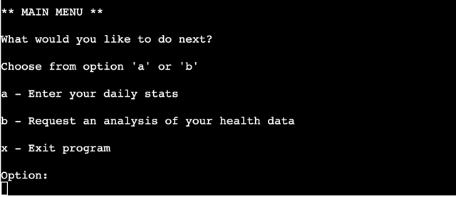

    The MAIN MENU acts as the program's anchor menu, to which the user always returns after executing a command. It offers the following two options:
    a) Enter your daily stats.
    b) Request an analysis of your health stats.

    - Option a prompts the user to input three key health metrics:
        1. Lowest heart rate during sleep.
        2. Total minutes of cardiovascular exercise for the day.
        3. Total minutes of mindful breathing exercises for the day.
    - Option b provides a weekly summary, fetching the data of last 7 days of entries including:
        1. The current average resting heart rate.
        2. The total amount of cardiovascular exercise performed.
        2. The total amount of mindful breathing exercises completed.
    
    As previously mentioned, the option to exit the program (option 'x') is always available in the menu.

7. <u>Interactive Element: User Enters Health Stats - Resting Heartbeat</u>

    

    After selecting option a) from the MAIN MENU, the user is presented with a brief message explaining the process and what data to enter. Each prompt includes a clear explanation of the required data.

8. <u>Interactive Element: User Enters Health Stats - Resting Heartbeat - Correct Input</u>>

    The user is expected to provide a whole number without decimals or trailing whitespace. Upon entering a valid input, the program moves on to the next health metric prompt.

    Since the program fetches data entries from the last 7 days rather than the last 7 inputs, the user can technically provide multiple entries per day. Entering the lowest heart rate of the day's resting period multiple times should not significantly impact the overall average, as the user’s heart rate is assumed to remain relatively stable over time.

9. <u>Interactive Element: User Enters Health Stats - Resting Heartbeat - Incorrect Input</u>

    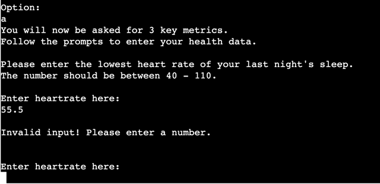
    
    

    The error handling recognizes two types of errors:

    - ValueError: Triggered when the input is not numeric (e.g., a word or non-integer value).
    - Invalid Range: Triggered when the input does not fall within a specified range.

    The program requires an integer for this input. Any other input triggers the message: "Invalid input. Please enter a number." Additionally, the program checks whether the number falls within a healthy resting heart rate range for adults. If the input is outside this range, the user is prompted with a message suggesting a valid range.

    Example input validation includes references to healthy ranges for adults. See [this source for reference.](https://www.mayoclinic.org/healthy-lifestyle/fitness/expert-answers/heart-rate/faq-20057979#:~:text=Answer%20From%20Edward%20R.%20Laskowski,to%20100%20beats%20per%20minute.)

    After each incorrect input, the user is asked to try again by entering a valid number or a number within the specified range.

10. <u>Interactive Element: User Enters Health Stats - Cardio minutes</u>

    

    After successfully entering the first health metric (resting heartbeat), the program prompts the user to input the second metric: total minutes of cardiovascular exercise for that day. This prompt is accompanied by a clear and straightforward message.

11. <u>Interactive Element: User Enters Health Stats - Cardio minutes - Correct Input</u>

    Upon entering valid data for this metric, the program prompts the user for the third and final health metric: total minutes of mindful breathing exercises for the day.

12. <u>Interactive Element: User Enters Health Stats - Cardio minutes - Incorrect Input</u>

    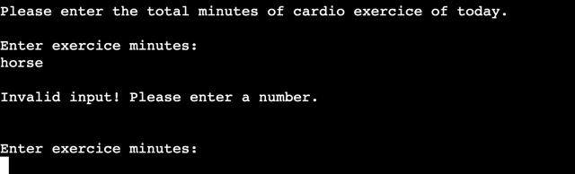
    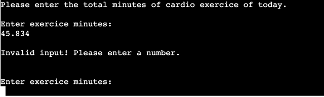

    The program requires an integer input for this metric. If the input is non-numeric (e.g., a word or float), the program displays the error message: "Invalid input! Please enter a number."

    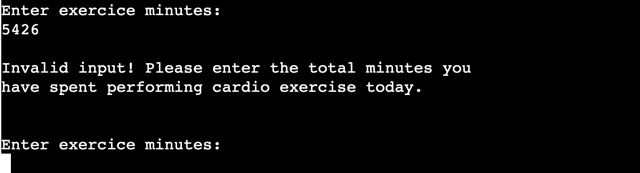

    While there is no universal consensus on how many minutes of cardio exercise per day is ideal or excessive, the program includes a check to prevent unrealistic inputs. A maximum limit of 1,440 minutes (24 hours) is enforced using an if-statement. This ensures that the input does not exceed the total minutes in a day. See [this source](https://odphp.health.gov/our-work/nutrition-physical-activity/physical-activity-guidelines/current-guidelines/top-10-things-know) for weekly exercise recommendations.
    
    After any incorrect input, the user is prompted to try again by providing a valid number within the specified range.

13. <u>Interactive Element: User Enters Health Stats - Breathwork minutes - Correct Input</u>

    

    After the user successfully enters a valid integer for breathwork minutes, the program prepares the data for submission to the Google Sheet.

14. <u>Interactive Element: User Enters Health Stats - Breathwork minutes - Incorrect Input</u>

    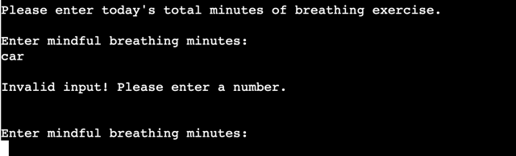
    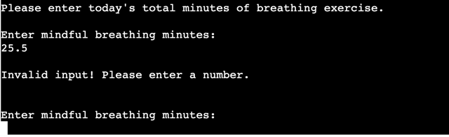

    If the input is invalid (e.g., non-numeric, float), the program displays an error message: "Invalid input! Please enter a number."

    

   The program enforces a realistic upper limit of 1,440 minutes (equivalent to 24 hours) using an if-statement. This ensures that the user cannot input an unrealistic duration. The loop continues until a valid integer within the acceptable range is provided.

15. <u>After successfull input of all health metrics, health data is written in a specified Google sheet with Google API client</u>

    

    Once all health metrics are successfully entered, the program writes the data to a specified Google Sheet using the Google API client. 

16. <u>Redirect to MAIN MENU after a time delay using time module</u>

    

    After successfully saving the data, the program redirects the user to the main menu following a short delay. The delay is implemented using the time module.

17. <u>Requesting analysis of weekly summary</u>

    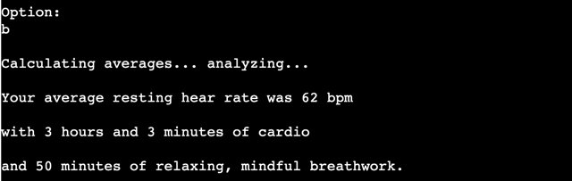

    The program fetches data entries from the last 7 days. It calculates and displays the following:
    - The average resting heart rate, rounded to the nearest integer.
    - Total minutes of cardiovascular exercise, displayed in hours and minutes.
    - Total minutes of breathwork practice, presented as a single total in minutes.
    
    This feature gives the user an overview of their weekly health trends.

18. <u>Motivational feedback after analysis</u>

    

    After presenting the weekly summary, the program provides a motivational message to encourage users to maintain consistent tracking and improve their health habits.

19. <u>Redirecting to MAIN MENU after analyis</u>

    

    After viewing the weekly summary, the user is prompted to press ENTER (or any input and ENTER) to return to the main menu. This ensures that users have sufficient time to review their results before making further selections. 
    
    The Main Menu offers the familiar options, including the ability to safely exit the program.

### Future Features

- More detailed error handling for inputs, including: Individual error messages for empty inputs, negative numbers, and whitespace inputs.
- Implement an 'exit' option during data entry.
- Handle invalid date formats and skip rows with invalid entries in case of error data transmission by the program.
- Display an error message if the spreadsheet/worksheet is unavailable or deleted.
- Separate inputs for resting heart rate, cardio minutes, and breathing exercises to accommodate multiple entries per day (user-friendlyness) without affecting analysis.
- Provide a summary of today’s entries after choosing option a) to help avoid duplicate data entries.
- Incorporate security prompts, such as flagging highly fluctuating resting heart rates, to encourage users to consult a doctor.
- Implement trend analysis comparing weekly summaries to long-term data, highlighting upward or downward trends in health metrics.


## Testing

### Code validation

| **Check** | **Description of Issue** | **Screenshot** |
|----------------|---------------------|----------------|
| - | 221: E501 line too long | 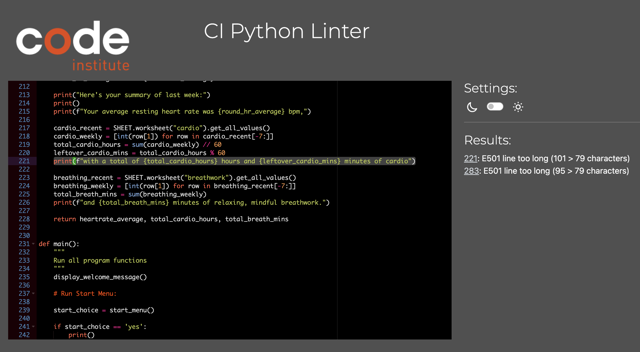 |
| - | 283: E501 line too long | 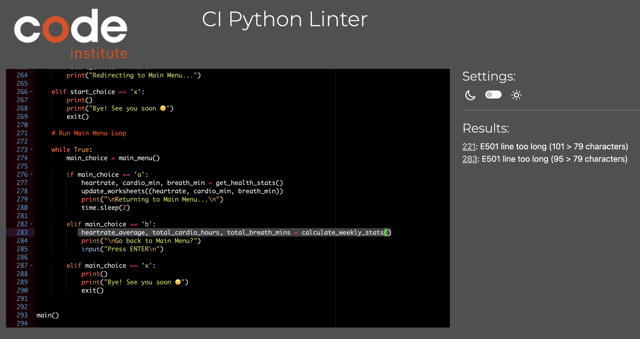 |
| ✅ | All clear, no errors found | 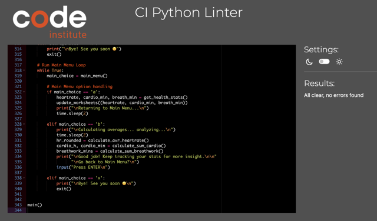 |

### Manual testing

| **validation** | **f(x)** | **description/expectation** | **comment** |
|----------------|----------|----------------|----------|
| ✅ | display_welcome_message() | display welcome message | . |
| ✅ | start_menu() | option: WRONG INPUT, random words, white space, enter | . |
| ✅ | start_menu() | option: yes | . |
| ✅ | start_menu() | option: yEs | . |
| ✅ | start_menu() | option: no | . |
| ✅ | start_menu() | option: nO_ | . |
| ✅ | start_menu() | option: x | . |
| ✅ | start_menu(): option: yes and proceed to MAIN MENU? | Any input to proceed | ENTER or any input and ENTER work to proceed to Main Menu |
| ✅ | main_menu() | option: x | prints statement and exits |
| ✅ | main_menu() | option: a | see: get_health_stats() |
| ✅ | main_menu() | option: b | see: calculate_avr_heartrate(); calculate_sum_cardio(); calculate_sum_breathwork() |
| ✅ | get_health_stats() | prompt for 3 entries | . |
| ✅ | get_health_stats() | error handling: wrong input | No input and ENTER is not accepted, white space is not accepted, error handling for ValueError works, error handling for out of num range works |
| ✅ | update_worksheets() | writes on Google sheet including timestamp in format yy-mm-dd | . |
| ✅ | update_worksheets() | displayes message of successful update of each worksheet | . |
| ✅ | calculate_avr_heartrate() | fetch all data from worksheet minus header | . |
| ✅ | calculate_avr_heartrate() | filter data for entries of last 7 days since today using datetime | . |
| ✅ | calculate_avr_heartrate() | validate there's data of last 7 days | . |
| ✅ | calculate_avr_heartrate() | calculate average and round to whole number | . |
| ✅ | calculate_avr_heartrate() | error handling for invalid input | . |
| ✅ | calculate_avr_heartrate() | output: message to user | . |
| ✅ | def calculate_sum_cardio() | fetch all data from worksheet minus header | . |
| ✅ | def calculate_sum_cardio() | filter data for entries of last 7 days since today using datetime | . |
| ✅ | def calculate_sum_cardio() | validate there's data of last 7 days | . |
| ✅ | def calculate_sum_cardio() | calculate sum and display hours and minutes using modulo | . |
| ✅ | def calculate_sum_cardio() | error handling for invalid input | . |
| ✅ | def calculate_sum_cardio() | output: message to user | . |
| ✅ | calculate_sum_breathwork | fetch all data from worksheet minus header | . |
| ✅ | calculate_sum_breathwork | filter data for entries of last 7 days since today using datetime | . |
| ✅ | calculate_sum_breathwork | validate there's data of last 7 days | . |
| ✅ | calculate_sum_breathwork | calculate sum | . |
| ✅ | calculate_sum_breathwork | error handling for invalid input | . |
| ✅ | calculate_sum_breathwork | output: message to user | . |
| ✅ | main() | back to MAIN MENU | works in all cases by pressing ENTER or any key and ENTER |
| ✅ | main() | exit() | works on all menus and displays output message to user |


### Bugs

| **Bug Description** | **Screenshot** | **Fix** | 
|---------------------|----------------|---------|
| print statement too long | 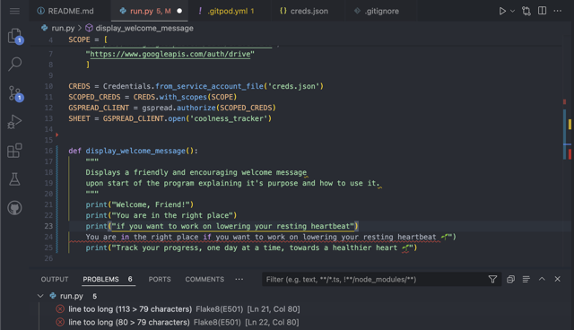 | Divided print statement in several lines |
| Error when inputtin uppercase or spaces in start menu | 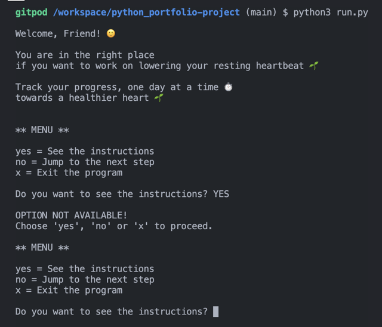 | add .strip() and .lower() methods to input field: ```instruction_choice = input("Do you need instructions? ").strip().lower()``` |
| Input upon main_menu redirects to start_menu instaed of displaying main_choice options | 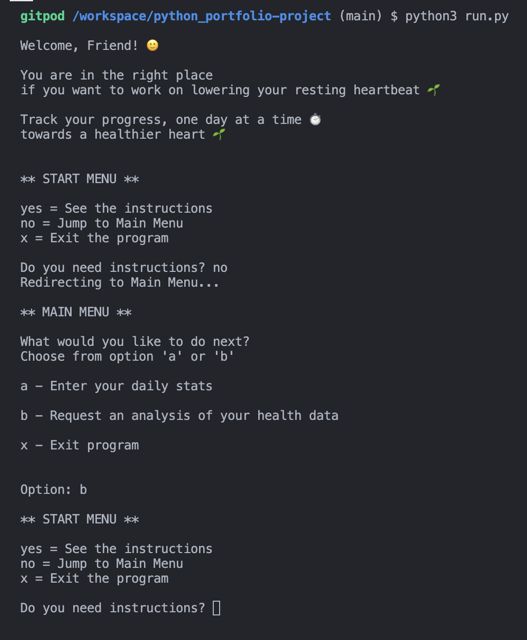 | add return statement to main_menu function; remove start_menu loop; comment out validate to proceed to main_menu after instructions; remove main_menu call from elif "no" to jump instructions; |
| health data input validation error | 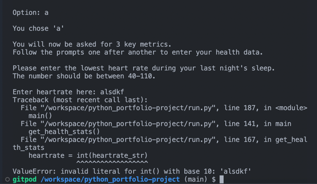 | put conversion ```int(heartrate_str)``` inside try/except code and wrap everything in a loop to give user a chance to put in right heartrate upon mistake |
| Use of wrong emoji leads to display of other symbols in deployed version | 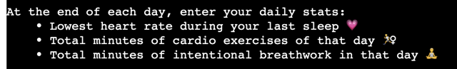 | Replace with neutral emoji |

### Known bugs

When the program is left and allowed to "sleep," input becomes impossible on certain browsers (Safari, Opera, and Chrome). Additionally, the terminal layout differs when accessed via Safari. 

## Technologies
- Programming language: Python
- Flake8 for on hand code validation
- CI Python Linter for final code validation
- gspread library for Google Sheets integration
- Google API client installed with google-oauth2 using the Google Cloud Setup

## Credits 

### Resources

- Code Institute's walkthrough project **Love Sandwiches** introduced me to most of the basic functions, module imports and methods.
- As an initial inspiration on how to get started on my project idea I used a [YouTube tutorial](https://www.youtube.com/watch?v=ZBx7oWCJ4aY) that introduced how to use while true loops to build menus.
- To learn about more python string methods, for the input and it's validation, the datetime module, list comprehensions, handling of tuples and more research about built-in functions I have mainly relied on the [W3Schools website](https://www.w3schools.com/python/), sometimes on [Geeksforgeeks](https://www.geeksforgeeks.org/python-datetime-strptime-function/), especially for the datetime module strptime() function, and [Stackoverflow](https://stackoverflow.com/).

### Acknowledgements

I would like to thank my mentor, Rory Patrick Sheridan, for his feedback and guidance.
